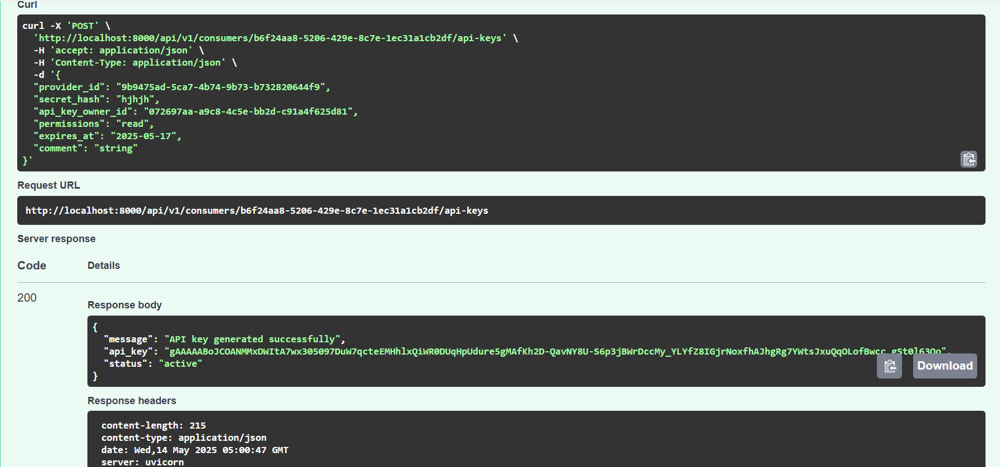
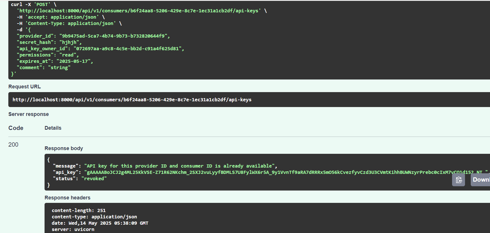
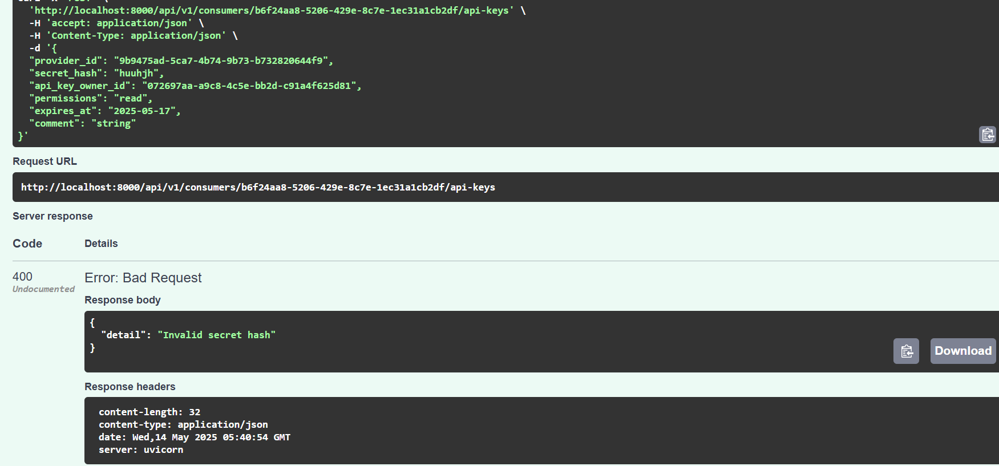
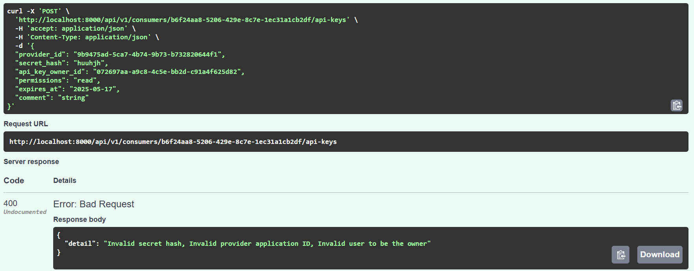
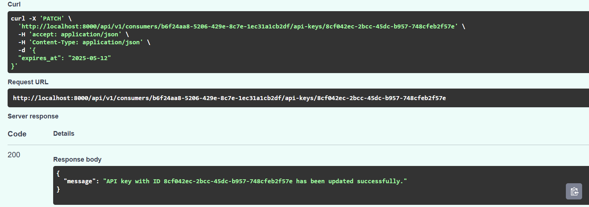
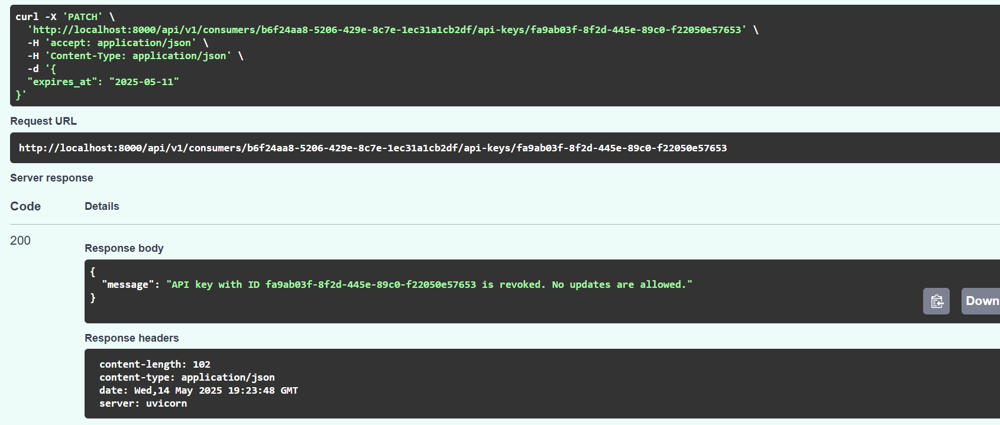
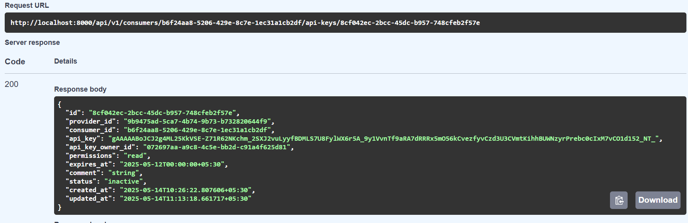

# App_to_App_Communication
## Installation
1. Clone the repository

    `git clone https://github.com/Keerthana-shri/App_to_App_Communication`

    `cd App_to_App_Communication`

2. From the root directory of the project, activate the shell after installing pipenv.

   `pip install pipenv`

   `pipenv install`

   `pipenv shell`

## Run the application

Change directory to src

`cd src`

Run the application with:

`uvicorn server:app --reload`

## Set up pre-commit hooks for linting

`pre-commit install`

# Successful API responses on API Key CRUD operations

## Creating API Key:

## Duplication of API Key creation is restricted when status is active/revoked

## Revoking API Key in the POST method, if the status is inactive

## Invalid messages

## Updating API Key details

## If status of any API key is "revoked" then updating it is not allowed

## Get API Key (Because the updated expire date is past the current date, the status has automatically changed to inactive)

## Deleting API Key

