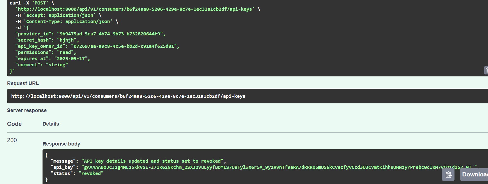
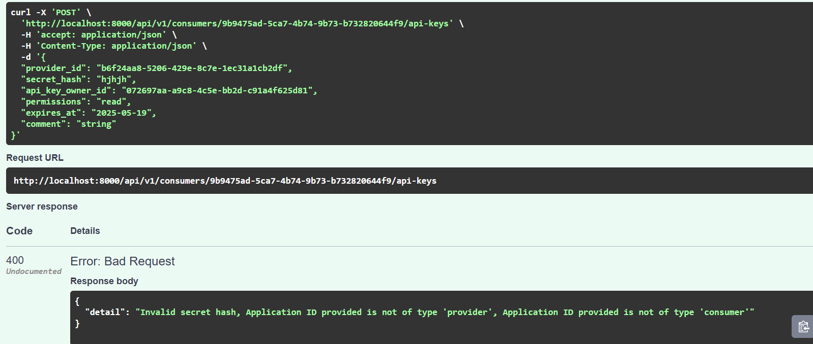
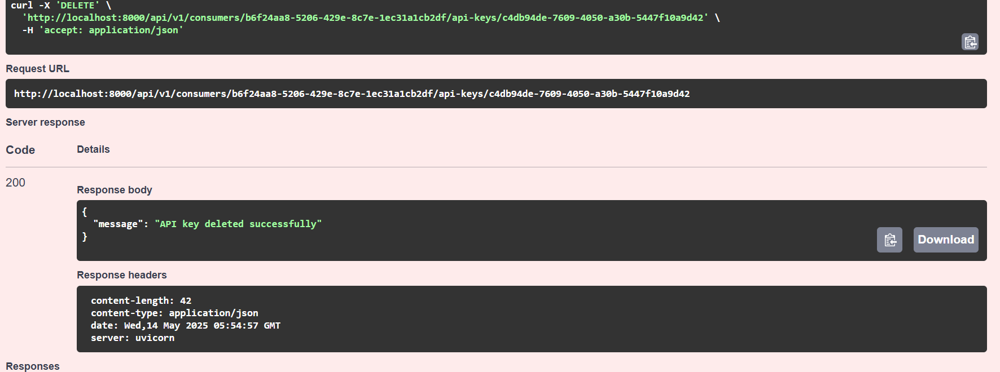

# Successful API responses on API Key CRUD operations

## Creating API Key:

## Duplication of API Key creation is restricted when staus is active/revoked

## Revoking API Key in the POST method, if the status is inactive

## Invalid messages

## Updateding API Key details

## Get API Key (Because the updated expire date is past the current date, the status has automatically changed to inactive)

## Deleting API Key

